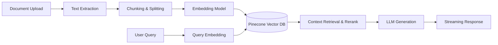

<div align="center">
  <h1>InsightFlow AI</h1>
  <p><em>Your Intelligent Context-Aware RAG Engine</em></p>

  [](https://www.python.org/)
  [](https://fastapi.tiangolo.com/)
  [](https://nextjs.org/)
  [](https://www.docker.com/)
  [](https://opensource.org/licenses/MIT)
</div>

## Project Overview

**InsightFlow AI** is a production-grade Retrieval-Augmented Generation (RAG) platform designed to ingest, chunk, embed, and query complex enterprise documents. It leverages state-of-the-art LLMs (OpenAI, Gemini), vector databases (Pinecone), and robust backend orchestration (LangChain/LangGraph) to deliver highly accurate, contextual answers. 

With InsightFlow AI, teams can chat with their data repositories, trace generation flows (LangSmith), track evaluation metrics (MLflow), and securely scale across AWS via a fully automated CI/CD pipeline.

## Features

- **Multi-Modal Document Processing**: Upload PDFs, DOCX, TXT, CSV, and Markdown.
- **Advanced RAG Pipeline**: Intelligent chunking, overlap control, semantic search, and re-ranking.
- **Provider Agnostic**: Switch seamlessly between OpenAI and Google Gemini.
- **Streaming Chat**: Real-time Server-Sent Events (SSE) for fluid conversation.
- **Document Comparison**: Ask questions across multiple documents simultaneously.
- **Automated Summarization**: One-click summary generation for long documents.
- **Telemetry & Tracing**: Full LangSmith integration for debugging LangChain runs.
- **Experiment Tracking**: Built-in MLflow logging for evaluation datasets and metrics.
- **Secure Authentication**: JWT-based auth with Role-Based Access Control (RBAC).
- **Enterprise Scale Infrastructure**: Docker Compose for local dev, AWS ECS/Fargate for prod.

## Tech Stack

| Category | Technologies |
|---|---|
| **Frontend** | Next.js 14, TypeScript, Tailwind CSS |
| **Backend** | Python 3.11, FastAPI, SQLAlchemy, asyncpg |
| **AI / Orchestration** | LangChain, LangGraph, OpenAI, Google Gemini |
| **Databases** | PostgreSQL 15, Redis 7 (Caching & Pub/Sub), Pinecone (Vector DB) |
| **Observability** | MLflow, LangSmith |
| **DevOps** | Docker, GitHub Actions, AWS ECS/ECR/ALB |

## System Architecture

### RAG Pipeline


### Infrastructure Layout
- **VPC** in AWS with public/private subnets.
- **ALB** distributing traffic to ECS Fargate tasks (Frontend & Backend).
- **S3** for raw document storage.
- **RDS (PostgreSQL)** for application state.
- **ElastiCache (Redis)** for session caching and chat history.

## Quick Start

1. **Clone the repository**
   ```bash
   git clone https://github.com/your-org/insightflow-ai.git
   cd insightflow-ai
   ```

2. **Initialize Environment**
   ```bash
   bash scripts/setup.sh
   ```
   *This copies `.env.example` to `.env`.*

3. **Configure API Keys**
   Open `.env` and add your keys:
   - `PINECONE_API_KEY`
   - `GEMINI_API_KEY` (or `OPENAI_API_KEY`)

4. **Start the Stack**
   ```bash
   docker compose up -d --build
   ```

5. **Seed the Database (Optional)**
   ```bash
   docker exec -it insightflow-backend python /app/scripts/seed_db.py
   ```

Access the UI at `http://localhost:3000` and API docs at `http://localhost:8000/docs`.

## Local Development Setup

We recommend using Docker Compose to spin up Postgres, Redis, and MLflow, then running the Backend and Frontend locally for live-reloading.

**Backend**:
```bash
cd backend
python -m venv .venv
source .venv/bin/activate
pip install -r requirements.txt
uvicorn app.main:app --reload
```

**Frontend**:
```bash
cd frontend
npm install
npm run dev
```

## Environment Variables

| Variable | Required | Description |
|---|---|---|
| `DATABASE_URL` | Yes | Postgres connection string |
| `REDIS_URL` | Yes | Redis connection string |
| `SECRET_KEY` | Yes | JWT signing key |
| `LLM_PROVIDER` | Yes | `openai` or `gemini` |
| `PINECONE_API_KEY` | Yes | Vector DB key |
| `MLFLOW_TRACKING_URI` | No | URI for MLflow server |
| `LANGCHAIN_API_KEY` | No | LangSmith API key |

*(See `.env.example` for the complete list.)*

## Docker Setup

The `docker-compose.yml` file orchestrates 5 services:
- **postgres**: Relational data (users, document metadata).
- **redis**: Cache and message broker.
- **mlflow**: Local ML experiment tracking UI on port 5001.
- **backend**: FastAPI application.
- **frontend**: Next.js application.

## API Reference

| Method | Endpoint | Description |
|---|---|---|
| POST | `/api/auth/register` | Register new user |
| POST | `/api/auth/login` | Authenticate and get JWT |
| POST | `/api/documents/upload` | Upload and process file |
| GET | `/api/documents` | List user documents |
| POST | `/api/chat` | RAG query |
| POST | `/api/chat/stream` | RAG query (SSE streaming) |
| POST | `/api/evaluations/run` | Trigger evaluation job |

## Testing

Run unit and integration tests:
```bash
bash scripts/run_tests.sh
```

Run RAG Evaluation Pipeline (Requires DB & Backend running):
```bash
cd evaluation
python run_evaluation.py --api-url http://localhost:8000
```

## MLflow Usage
Evaluations are logged to MLflow if `MLFLOW_TRACKING_URI` is set. 
Visit `http://localhost:5001` to view your `RAG_Evaluation` experiments, comparing Recall, Precision, and Relevance across different chunking sizes and LLM models.

## LangSmith Usage
Set `LANGCHAIN_TRACING_V2=true` and `LANGCHAIN_API_KEY` in `.env`. LangSmith will automatically record all LangChain components, agent steps, and LLM input/output for debugging complex RAG workflows.

## AWS Deployment
Deployment to AWS ECS Fargate is automated via GitHub Actions (`.github/workflows/cd.yml`).
For manual deployment or initial setup:
```bash
bash infrastructure/aws/deploy.sh production
```
See `infrastructure/aws/README.md` for complete VPC and ECS prerequisite setup.

## Known Limitations / Current State
- Document processing currently supports files up to 50MB.
- Real-time OCR for scanned PDFs is experimental.
- Local LLM inference (e.g., Ollama) is not yet supported.

## Future Improvements
- [ ] Implement GraphRAG for complex multi-hop entity relationships.
- [ ] Add support for Anthropic Claude 3 models.
- [ ] Integrate local embedding options (SentenceTransformers) to reduce API costs.

## Contributing
1. Fork the repo.
2. Create your feature branch (`git checkout -b feature/amazing-feature`).
3. Commit your changes (`git commit -m 'Add amazing feature'`).
4. Push to the branch (`git push origin feature/amazing-feature`).
5. Open a Pull Request.

## License
Distributed under the MIT License. See `LICENSE` for more information.
